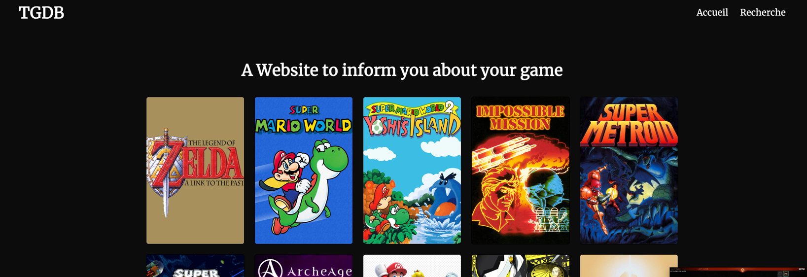

# TGDB
TGDB, The Game Database est un projet réalisé pour WEBR3. Il s'agit d'un site web permettant de consulter des informations sur des jeux vidéos,



## Etudiant
- Adnane AZAOUM - 54435

## Outils utilisés
* [Laravel](https://laravel.com/docs/9.x)
* [Composer](https://getcomposer.org/doc/)
* [PHP](https://www.php.net/docs.php)
* [MySQL](https://dev.mysql.com/doc/)

## Notes
le .env est à modifier pour la connexion à la base de données.

## Lancement
``` php artisan serve```


### Consignes 
#### Layout
- [x] Mise en page générale
- [x] Un en-tête reprenant le titre / logo du site. Ce titre fait un lien vers la page
  d’accueil
- [x]  Un menu de navigation présentant au moins un lien vers la page d’accueil et
  la page de recherche.
- [x] Un pied de page qui reprend votre nom, l’année et le sigle du cours
----
#### Home Page
- [x] Mise en page générale
- [x] Sur la page d’accueil, présentez brièvement votre site avec un texte.
- [x] Un affichage qui montre une liste du top 10 des jeux les mieux notés dans la base de données afficher l’image de couverture et le titre de ces jeux, et faire un lien vers leurs
  pages respectives.
----
#### Game Page
- [x] Mise en page générale
- [x] Infos minimales du jeu
- [x] Infos complémentaires du jeu
- [x] Votre interface doit éviter des zones vides, et doit pouvoir afficher plusieurs résultats s’ils existent.
----
#### Page de recherche
- [x] Mise en page générale
- [x] la page n’est pas rechargée
- [x] Recherche fonctionnelle
- [x] Recherche approximative fonctionnelle (par exemple, taper « Mario » fera aussi apparaître « Super Mario Bros »)
----
#### API
- [x] Endpoint fonctionnel
- [x] Recherche approximative
----
#### Autre
- [x] Code HTML valide
- [x] utiliser une grille pour agencer les page 
- [x] responsive
